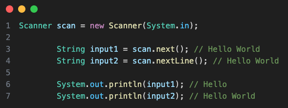

# String Java NoteBook

- Inbuilt class with Capital 'S'
- 2 methods for creating the String in java:
  1. Using String literal
  2. Using String Object

`In java String are immutable` => Interview.

Q: Difference btw next() and nextLine() while taking input?

# Function in the string:

1. length():
2. charAt(): takes the index (Starting from 0) as parameter and Returns the character at the specified index in a string.
3.
