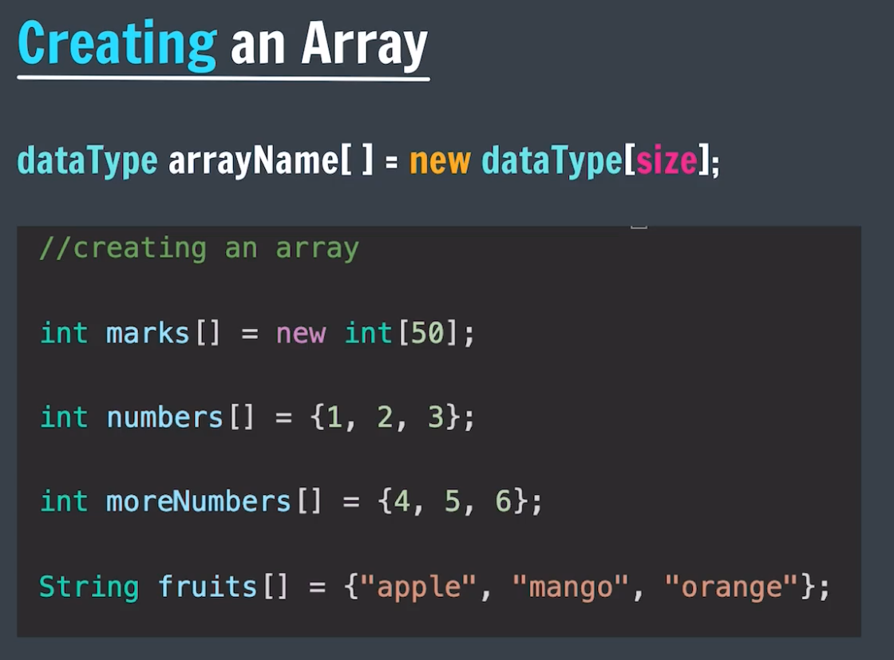

# Arrays Notes:

- StoryLine: Why array introduced and problem with variable -> Problem of Scalability.
- `What?` :
  - List of elements of `same` type placed in `contiguous` memory locations
  - Array is zero-indexed data structure

# Syntax of array Creation:

  
  

    1. Size of array is static → i.e. we can't change the size at runtime  
    2. Declaring the size of the array is mandatory  
    3. Another syntax of array: in which size of array is equal to number of elements mentioned  
    4. If array is not initialized then the default value is stored in the array.  
    5. Default value:  
       &nbsp;&nbsp;&nbsp;&nbsp;&nbsp;&nbsp;a. int ⇒ 0  
       &nbsp;&nbsp;&nbsp;&nbsp;&nbsp;&nbsp;b. String ⇒ null  
       &nbsp;&nbsp;&nbsp;&nbsp;&nbsp;&nbsp;c. char ⇒ \u0000 
       &nbsp;&nbsp;&nbsp;&nbsp;&nbsp;&nbsp;d. boolean => false  
  

# Input in the array

- Using the `Scanner class` Object

# Length Property in array:

- length: The length field is used to get the size of the array, and it is accessed directly.
- For example: `${arrayName}.length` will return the size of the array.

# Passing the array as argument:

- Java uses pass-by-value for everything, but when you pass an object (like an array), you are passing the reference to that object by value. This means the method gets a copy of the reference (or pointer) to the array.
- When you pass an array to a method, the method gets a copy of the reference to the original array. Modifying the array elements inside the method will affect the original array since both the original reference and the copy of the reference point to the same array in memory.
- `No Reference Reassignment:` If you try to reassign the array inside the method (i.e., make it point to a new array), the reassignment will not affect the original array outside the method because the reference itself was passed by value.
